# OpenUI MCP Studio

Turn a UI brief into real React and shadcn files you can preview, inspect, and
verify before you trust them.

OpenUI MCP Studio turns a prompt into a governed UI shipping workflow. It does
not stop at code generation. It writes files, runs quality gates, and keeps a
default proof target ready for smoke, visual, and UI/UX validation.

Local bootstrap remains a construction-only bridge. Public release confidence
still depends on explicit repository checks such as `npm run security:oss:audit`
and `npm run release:public-safe:check`.

> Runtime truth:
> the real system entrypoint is `services/mcp-server/src/main.ts`.
> `apps/web` is the default proof target for smoke, visual, and UI/UX checks.
> It is not the primary product entrypoint.

English is the canonical source of truth for repository governance and
maintenance.

[](https://github.com/xiaojiou176-open/openui-mcp-studio/releases)
[](https://github.com/xiaojiou176-open/openui-mcp-studio/discussions)
[](./LICENSE)
[](./docs/proof-and-faq.md)

[Quick Start](#quick-start) |
[Demo Proof](./docs/proof-and-faq.md#demo-proof) |
[Warm Start](./docs/first-minute-walkthrough.md) |
[Evaluator Checklist](./docs/evaluator-checklist.md) |
[Architecture](./docs/architecture.md) |
[Releases](https://github.com/xiaojiou176-open/openui-mcp-studio/releases) |
[Discussions](https://github.com/xiaojiou176-open/openui-mcp-studio/discussions) |
[Docs Index](./docs/index.md)

<p align="center">
  <strong>Prompt to UI</strong> |
  <strong>Apply into workspace</strong> |
  <strong>Verify before ship</strong>
</p>

<p align="center">
  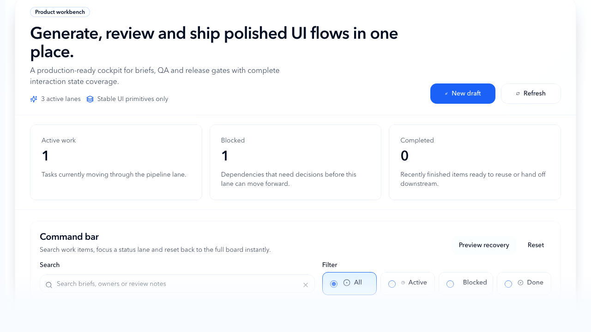
</p>

<p align="center">
  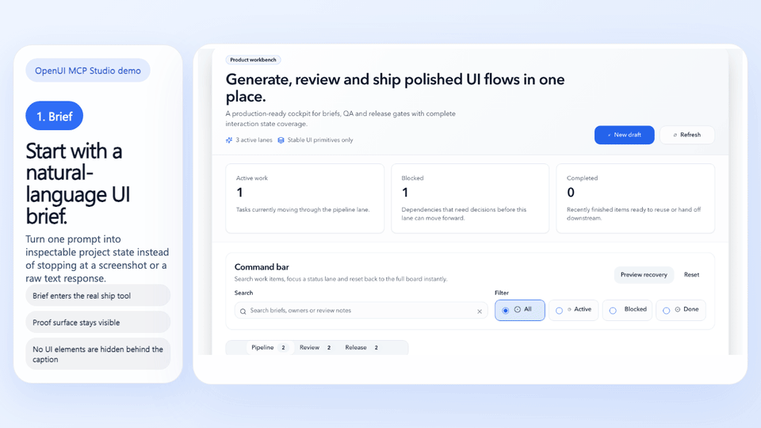
</p>

> Save this repository if you want a reusable workflow for turning UI briefs
> into reviewed, testable frontend delivery instead of one-off generated code.

<table>
  <tr>
    <td width="33%">
      <strong>Who this helps</strong><br />
      Teams evaluating AI-assisted frontend delivery without giving up review gates.
    </td>
    <td width="33%">
      <strong>What makes it different</strong><br />
      It can generate UI, apply files, and keep quality gates in the story.
    </td>
    <td width="33%">
      <strong>Where to start</strong><br />
      Jump to <a href="#quick-start">Quick Start</a>, <a href="./docs/proof-and-faq.md#demo-proof">Demo Proof</a>, or <a href="https://github.com/xiaojiou176-open/openui-mcp-studio/discussions">Discussions</a>.
    </td>
  </tr>
</table>

## Choose Your Path

<p align="center">
  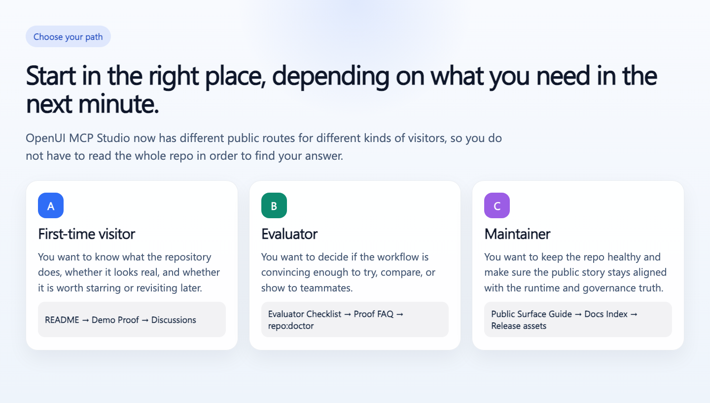
</p>

## What You Get

- A local MCP workflow that starts from a natural-language brief and ends with
  generated, applied, and validated frontend files.
- A default proof target at `apps/web`, so you can see the flow working instead
  of trusting a marketing promise.
- A governed delivery path with smoke, E2E, visual, and readiness checks when
  you want more than "the model produced some files."
- A deterministic front-door gate by default, while live Gemini, mutation, and
  strict docs evidence stay in explicit manual or release lanes instead of
  blocking every routine push.

<p align="center">
  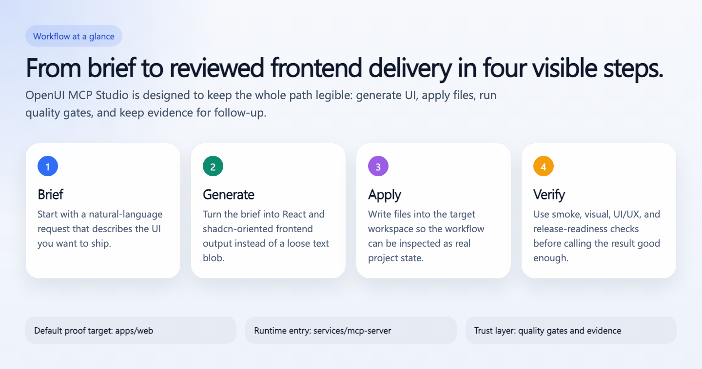
</p>

## Proof Ladder

Use the lightest path that answers your real question.

| Path | Use it when | What it proves | What it does not prove |
| --- | --- | --- | --- |
| `npm run demo:ship` | your machine is already ready and you want one fast proof | one real ship-tool payload from the current repo | not a cold-start setup, not `repo:verify:full`, not a public-safe verdict |
| `npm run repo:doctor` | you want a fast structural trust check | the repo-side contracts, runtime, evidence, upstream policy, and release-readiness inputs are healthy | not full local parity and not remote platform closure by itself |
| `npm run repo:verify:full` | you want the stronger repo-local verification lane | the local container-parity verification path still holds | not remote GitHub governance truth by itself |
| `npm run release:public-safe:check` | you want the strict repo-side public-safe verdict | docs, remote evidence, and history hygiene agree on a strict repo-side verdict | not legal sign-off, product judgment, or rollout approval |

## Fastest Visible Proof

Use this path only when your local environment is already ready.
This is the **warm-start** proof lane, not the clean-machine setup path.

```bash
npm run demo:ship
```

This path assumes:

- Node `22.22.0` is already available
- repo dependencies are already installed (you have already run `npm install` in this checkout)
- `GEMINI_API_KEY` is already set in `.env` or your shell
- you only need one rerunnable proof, not a full clean-room setup

What this gives you right away:

- a real run of `openui_ship_react_page`, not a fake placeholder command
- generated React and shadcn file output printed as JSON
- a safe default preview path because the demo stays in `dryRun` mode unless you
  opt into `--apply`
- one rerunnable proof that the ship tool is live, **not** a replacement for
  `repo:verify:full` or `release:public-safe:check`

The built-in sample prompt asks for a polished pricing-page hero. If you want to
swap in your own brief:

```bash
npm run demo:ship -- --prompt "Create a launch-ready landing hero with a headline, CTA row, feature grid, and testimonial strip."
```

If you want the demo to actually write into the default proof target:

```bash
npm run demo:ship -- --apply
```

If your Gemini route is slow and you want a more forgiving first run:

```bash
npm run demo:ship -- --timeout-ms 120000
```

If you are starting from a completely cold machine, use
[Cold Start Quick Start](#cold-start-quick-start) instead. That path installs
Playwright, builds the repository, and proves the default proof target end to
end.

## Use Cases

<p align="center">
  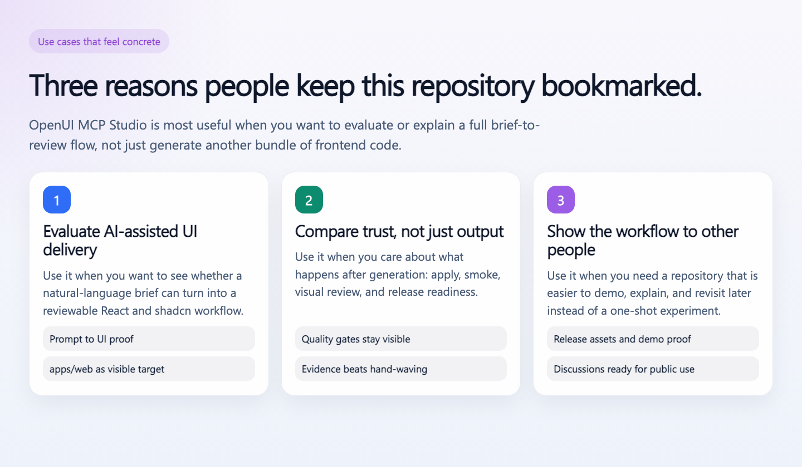
</p>

- Evaluate whether natural-language UI briefs can turn into a reviewable React
  and shadcn workflow.
- Compare trust, not only output, by keeping apply, smoke, visual review, and
  release readiness visible.
- Show the workflow to other people with reusable proof assets, release assets,
  and public discussions.

### Built For

- teams evaluating AI-assisted frontend delivery without giving up review gates
- developers who want generated UI to land as React, Tailwind, and shadcn files
- people who need a repeatable workflow they can revisit, demo, and audit later

<table>
  <tr>
    <td width="50%">
      <strong>Good fit</strong><br />
      Natural-language UI generation with a reviewable delivery path, real proof
      surface, and repeatable validation.
    </td>
    <td width="50%">
      <strong>Not the right fit</strong><br />
      Hosted zero-setup SaaS expectations, static screenshot generation, or a
      generic frontend starter with no MCP workflow.
    </td>
  </tr>
</table>

### Not Just Another Generator

This repository is closer to a shipping studio than a prompt toy.

- It can generate UI from a brief.
- It can apply files into the target workspace.
- It can run quality gates before you treat the result as done.
- It keeps runtime evidence so the result is inspectable, not magical.

<p align="center">
  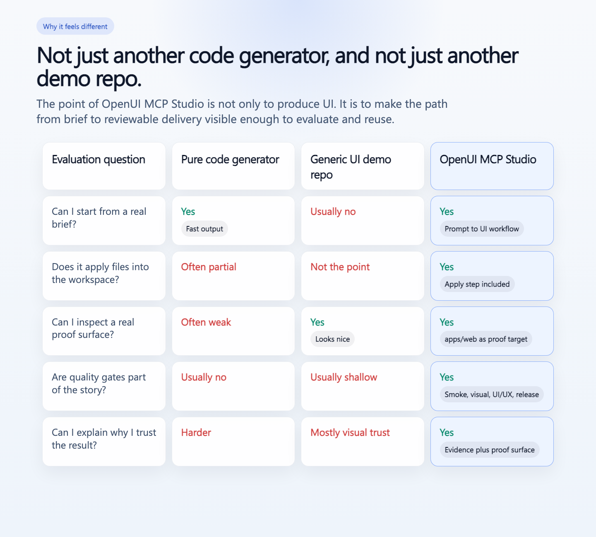
</p>

## Visual Tour

These frames are meant to be read as evidence, not as decorative thumbnails.

**1. Brief**
Start from a natural-language UI request.

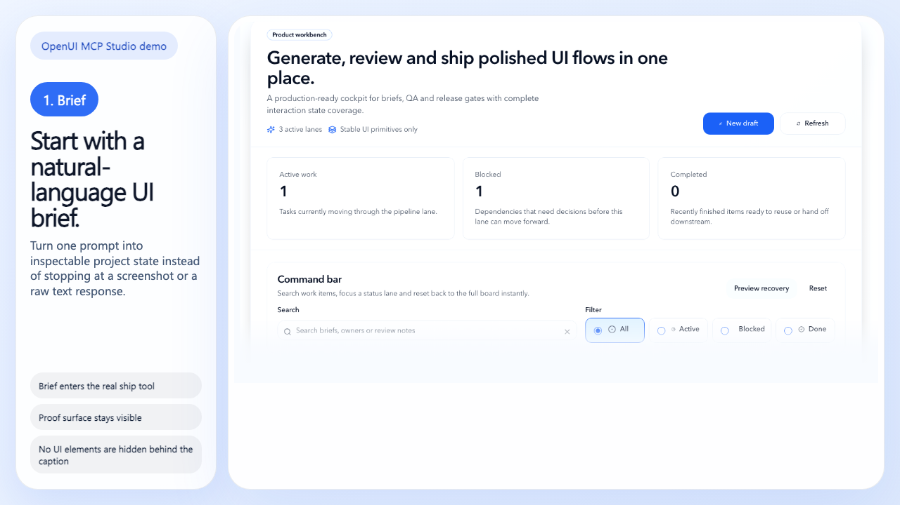

**2. Review**
Inspect the workbench before trusting the output.

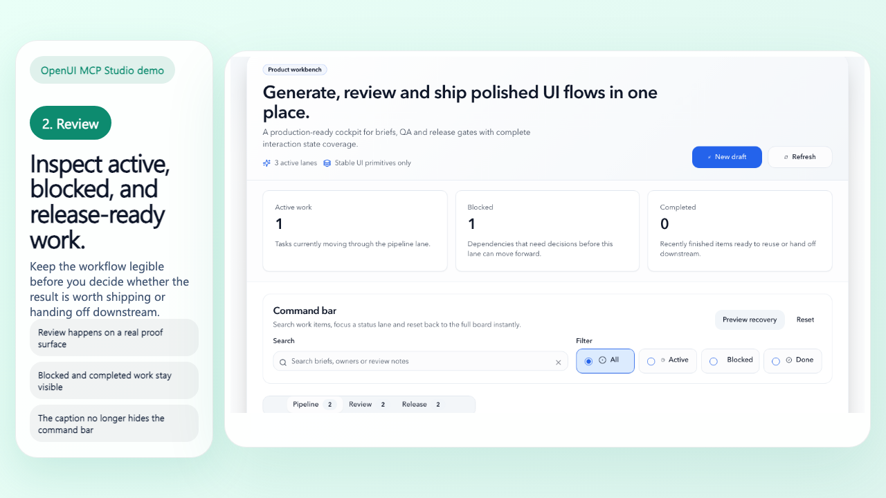

**3. Ship**
Keep gates in the loop before calling it done.

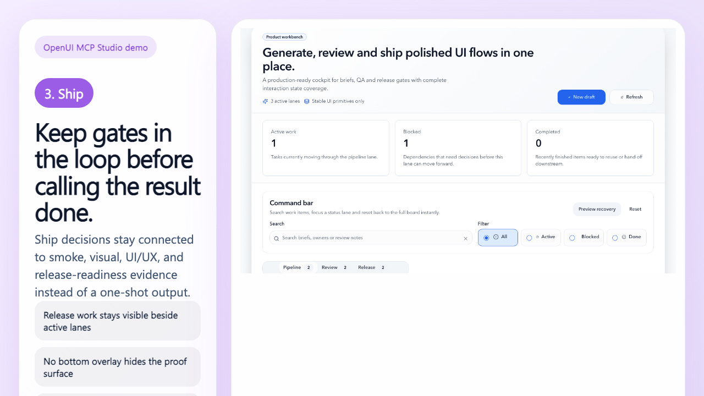

## Quick Start

### Prerequisites

- Node `22.22.0`
- A valid `GEMINI_API_KEY`
- Playwright browsers installed once for the local proof surface

### Cold Start Quick Start

Use this path when you are starting from a clean or mostly clean machine and
want the repository front door to prove it is alive.

```bash
npm install
cp .env.example .env
npx playwright install chromium
npm run build
npm run demo:ship
npm start
```

### What You Should See

After the fastest path:

- `npm run demo:ship` returns generated file payloads from the real ship tool
- the MCP server starts from `.runtime-cache/build/mcp-server/main.js`
- the default proof target remains `apps/web`
- you can inspect the repository's product-facing surface before diving into
  deeper governance paths

The demo command prefers `GEMINI_MODEL_FAST` when that env var is available and
lets you raise the request window with `--timeout-ms` for slower live provider
runs.

### Warm Start Quick Proof

If your machine already has Node, dependencies, and `GEMINI_API_KEY` in place,
use [`docs/first-minute-walkthrough.md`](./docs/first-minute-walkthrough.md)
for the faster warm-start route.

### Stricter Repo-Side Verification

If you want the stricter path that proves the repository is not a one-shot demo,
run the repo-side verification lane:

```bash
npm run repo:doctor
npm run repo:space:report
npm run repo:space:check
npm run repo:space:verify
npm run repo:space:maintain:dry-run
npm run smoke:e2e
```

If you want the authoritative local parity path rather than the lighter front
door checks, run:

```bash
npm run repo:verify:full
```

### Full Governed Path

Use this path when you are evaluating public-safe trust, not just startup.

```bash
npm run lint
npm run typecheck
npm run test
npm run test:e2e
npm run smoke:e2e
npm run release:public-safe:check
```

## Demo Proof

The public proof surface comes from the real workbench rather than synthetic
marketing art.

<p align="center">
  
</p>

### The Core Flow In One View

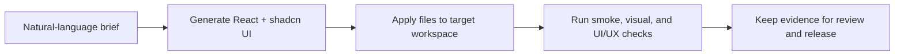

For a deeper walkthrough, see [Demo Proof and FAQ](./docs/proof-and-faq.md).

## How It Works

You can think of the system like a product studio with a built-in review desk.
The model drafts the work, the repository applies it safely, and the quality
gates decide whether the output is good enough to keep moving.

1. The MCP server receives a UI brief.
2. The ship pipeline generates HTML and converts it into React and shadcn files.
3. Files are applied under repository path rules.
4. Quality gates check the result before you treat it as a trustworthy output.
5. Runtime evidence is stored under `.runtime-cache/runs/<run_id>/...` so the
   workflow is inspectable.

The implementation entrypoint stays at
`services/mcp-server/src/main.ts`, while `apps/web` is the default proof target
for smoke, E2E, visual, and UI/UX checks.

The broader repository identity still matters:

- `services/mcp-server` is the runtime and orchestration center.
- `contracts/*` and `tooling/*` stay in the public story because they define how
  the governed delivery path stays trustworthy.
- This repository is a long-lived productized fork and uses selective port
  maintenance instead of whole-repo upstream merge as the default route.

## What Makes It Different

| Tool style | What you get | What is missing |
| --- | --- | --- |
| Pure code generator | Fast output | Usually stops before apply, proof, or quality gates |
| Generic UI demo repo | Nice screenshots | Weak evidence that the workflow can ship real files |
| Agent flow without gates | Flexible automation | Harder to trust the result under repeatable checks |
| **OpenUI MCP Studio** | Generation, application, validation, and reviewable evidence in one path | Still needs your product judgment for what to ship |

### Why It Wins For Evaluation

- **More than "looks good"**: the result can be smoke-tested and reviewed.
- **More than "the model said so"**: runtime evidence is kept for follow-up.
- **More than a fixture**: `apps/web` is treated as the default proof surface,
  not a disposable demo page.

## Hard Evidence You Can Re-Run

These are not marketing bullets. They are front-door checks you can rerun on
your own machine.

| What you want to verify | Command | What you should get back |
| --- | --- | --- |
| Can it produce one real UI result fast? | `npm run demo:ship` | generated file payload for a sample brief |
| Is the repo structurally healthy? | `npm run repo:doctor` | repository-side readiness verdict |
| What is taking repo-local space right now? | `npm run repo:space:report` | repo-local footprint plus shared-layer defer map, repo-specific external cache roots, and reclaimable bytes by cleanup class |
| Is repo-local space governance drifting? | `npm run repo:space:check` | front-door repo-local gate verdict: no hard-fail pollution and no unknown heavy non-canonical runtime subtree |
| Which candidates are currently eligible for controlled repo-local maintenance? | `npm run repo:space:verify` | contract candidates plus maintenance-candidate eligibility snapshot |
| What would the current repo-local maintenance wave reclaim without deleting anything? | `npm run repo:space:maintain:dry-run` | projected repo-local reclaim plan plus skip reasons |
| Apply the explicit repo-local maintenance wave | `npm run repo:space:maintain` | controlled repo-local cleanup summary under `.runtime-cache/reports/space-governance/maintenance-latest.*` |
| What is the current repo-side security evidence bundle? | `npm run security:evidence:final` | PII + ScanCode final evidence pack under `.runtime-cache/reports/security/` |
| What is the current remote canonical review verdict? | `npm run governance:remote:review` | remote/platform review plus mirror audit summary |
| Does the default proof target boot like a real app? | `npm run smoke:e2e` | smoke verdict against `apps/web` |
| Do the public assets and GitHub surface stay aligned? | `npm run public:surface:check` | local asset freshness plus live public-surface contract |

## Why Keep It On Your Radar

This repository is worth starring when you want a reference that is both useful
today and easy to revisit later.

| Reason to bookmark it | Plain generator repo | OpenUI MCP Studio |
| --- | --- | --- |
| First visible result | often starts with a screenshot or a promise | `npm run demo:ship` gives you a real ship payload |
| Trust story | you wire your own checks | proof target, smoke, visual, UI/UX, and release checks are already part of the repo |
| Reuse value | one-off prompt experiments | repeatable workflow you can demo, compare, and share |
| Public proof | scattered or missing | release assets, Discussions, docs router, and proof pages already lined up |

If you want the canonical explanation of what those proof commands do and do
**not** prove, use [Demo Proof and FAQ](./docs/proof-and-faq.md).

## When This Is A Good Fit

- You want natural-language UI generation with a reviewable delivery path.
- You care about applying files and validating them, not only seeing model
  output.
- You want a local MCP-first workflow that can plug into tools like Claude Code
  and Codex.

## When This Is Not A Good Fit

- You only want a static screenshot generator.
- You need a hosted SaaS with zero local setup.
- You want a generic frontend starter without MCP, runtime evidence, or quality
  gate discipline.

## Proof And Trust

This repository is not asking you to trust a beautiful screenshot. It keeps a
real engineering trail.

<p align="center">
  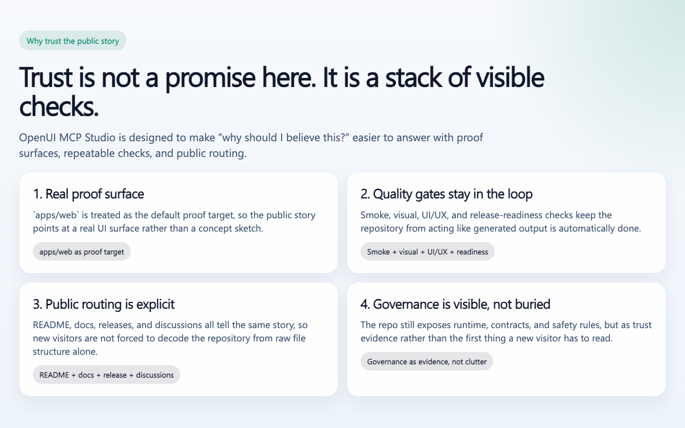
</p>

- `npm run repo:doctor`
  - quick repository health check across governance, runtime, and readiness
- `npm run repo:space:report`
  - shows repo-local disk footprint, runtime split, deferred shared layers, repo-specific external cache roots, and reclaimable bytes by cleanup class
- `npm run repo:space:check`
  - front-door repo-local space-governance gate; fails on hard-fail pollution and unknown heavy non-canonical runtime subtrees
- `npm run repo:space:verify`
  - reports contract verification candidates plus repo-local maintenance eligibility, active-ref state, age, and skip reasons
- `npm run repo:space:maintain:dry-run`
  - generates the explicit no-delete maintenance plan for repo-local cleanup
- `npm run repo:space:maintain`
  - applies the explicit repo-local maintenance wave and writes `maintenance-latest.*` under `.runtime-cache/reports/space-governance/`
- `npm run smoke:e2e`
  - confirms the default proof surface boots and behaves like a real app
- `npm run release:public-safe:check`
  - confirms public-release discipline rather than "it worked on my machine"
  - runs the strict docs lane in addition to release-readiness and remote/history checks
- `npm run governance:history-hygiene:check`
  - makes sure release confidence is not based on current-tree scans alone

Machine-level shared layers remain outside the default repo-local maintenance lane:

- Docker.raw
- `~/.npm`
- `~/.cache/pre-commit`
- `~/Library/Caches/ms-playwright`
- Cursor `workspaceStorage` / `globalStorage`

Treat those as operator-maintained machine surfaces rather than `repo:space:maintain` targets.

In plain language:

- this is **not** just a demo screenshot repo
- generated UI is **not** treated as automatically good enough
- public-facing trust is backed by explicit checks instead of hand-waving

## Community And Release Surface

### Start Here

- [Docs Index](./docs/index.md)
- [Architecture](./docs/architecture.md)
- [Testing Guide](./docs/testing.md)
- [Proof and FAQ](./docs/proof-and-faq.md)
- [Evaluator Checklist](./docs/evaluator-checklist.md)
- [Public Surface Guide](./docs/public-surface-guide.md)
- [Release Notes Template](./docs/release-template.md)

### Participate

- [License](./LICENSE)
- [Contributing Guide](./CONTRIBUTING.md)
- [Support Guide](./SUPPORT.md)
- [Security Policy](./SECURITY.md)
- [Codeowners](./CODEOWNERS)
- [Code of Conduct](./CODE_OF_CONDUCT.md)

### GitHub Surface

- Discussions are the home for questions, ideas, and show-and-tell threads.
- Issues stay focused on reproducible bugs and workflow failures.
- Releases should explain what users gained, not just list commits.

## Connect It To Your MCP Client

### Claude Code

```bash
claude mcp add --transport stdio --env GEMINI_API_KEY=your_key openui -- \
  node /ABS/PATH/openui-mcp-studio/.runtime-cache/build/mcp-server/main.js
```

### Codex CLI

```bash
codex mcp add openui --env GEMINI_API_KEY=your_key -- \
  node /ABS/PATH/openui-mcp-studio/.runtime-cache/build/mcp-server/main.js
```

### Sample Prompt To Paste

Use this exact brief if you want the same quick demo that powers `npm run demo:ship`:

```text
Create a polished pricing page hero for OpenUI MCP Studio. Include a short headline, a one-line value proposition, three pricing tiers, one highlighted recommended plan, and a compact trust row for smoke, visual, and release checks.
```

## FAQ

### Is this the same thing as upstream OpenUI?

No. This repository is a long-lived productized fork that keeps upstream
visible for selective adoption while focusing on a governed MCP-based UI
shipping workflow.

### Why call it a studio?

Because the repository is designed around the whole path from brief to reviewed
output. It is not only a code emitter and it is not only a frontend sample.

### Does it change runtime contracts?

No. This README changes the public presentation layer. It does not change MCP
tool contracts, env contracts, or the ship pipeline behavior.
